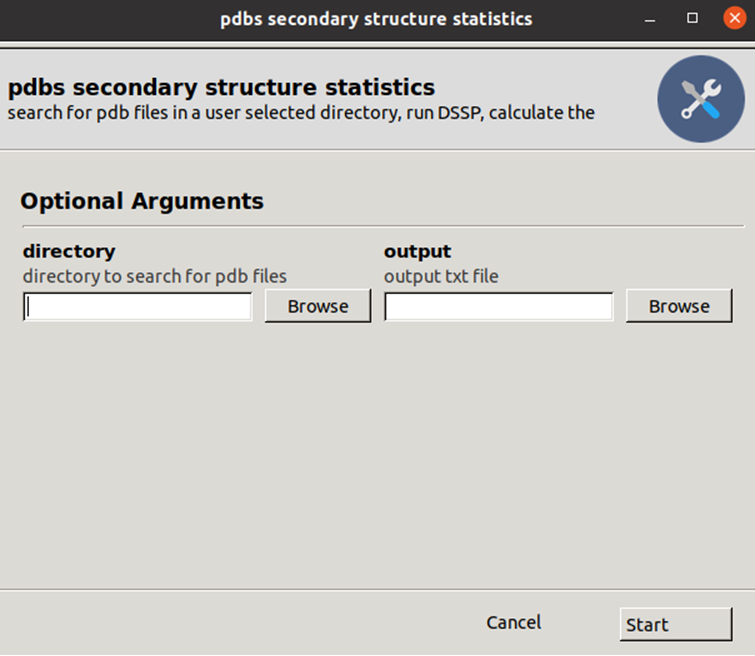
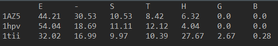

# pdbs secondary structure statistics 
Linux GUI Program to calculate the percentage of each secondary structure for each input pdb file in a user specified directory



## Depedences
1. linux OS (tested on ubuntu 20.04 LTS)
2. python 3.8.2 or later
3. anaconda or miniconda
4. Gooey `conda install -c conda-forge gooey`(if you get errors during installation or runtime try installing gtk `sudo apt-get install libgtk-3-dev`)
5. DSSP `conda install -c salilab dssp`
6. biopython `pip install biopython`
7. pandas `pip install pandas`

## linux desktop app installation
1. open a linux text editor and edit in the python file the shebang and the PATH to the dssp executable. To find where they are located in the system type:  

```
which python3
which dssp
```
2. convert to executable with `chmod +x pdbs_secondary_structure_statistics_gui.py`
3. open a linux text editor and edit the PATHs in the `.desktop` file
4. move the file to /usr/share/applications
5. reboot your machine

## Example output
The program's output file will look like:



For output explanation look up the [DSSP codes](https://biopython.org/docs/1.76/api/Bio.PDB.DSSP.html)
